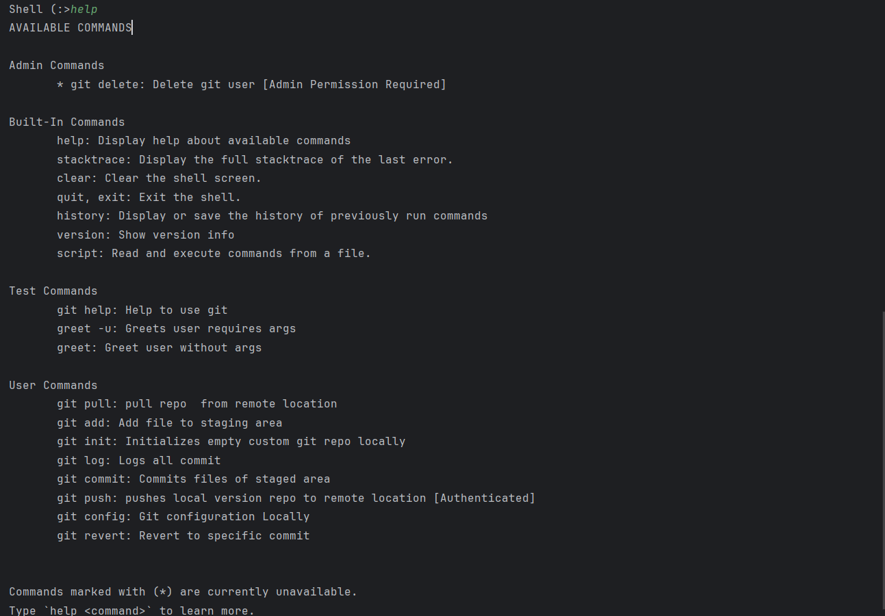
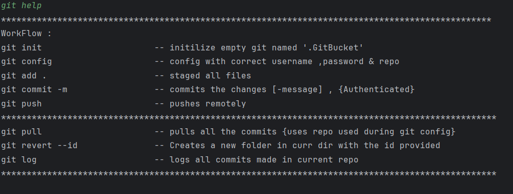

[//]: # (Welcome to version control system build in java language using spring framework.)

[//]: # ()
[//]: # ()
[//]: # (Tech stack :)

[//]: # (Spring framework )

[//]: # (    Spring shell -- For integrated shell)

[//]: # (Cloudflare R2 : Storing files as objects recurseviely)

[//]: # (Mongo Db : User registration)

[//]: # ()
[//]: # ()
[//]: # ()
[//]: # ()
[//]: # (Before you start :)

[//]: # (1. You must register for Cloufare R2 cloud object storage.)

[//]: # (2. Mongo Db Atlas credentials)

[//]: # ()
[//]: # (Update applications.yml file)

[//]: # (server :)

[//]: # (   port : 9696)

[//]: # ()
[//]: # (spring:)

[//]: # (   shell:)

[//]: # (    interactive:)

[//]: # (      enabled: true)

[//]: # (    debug: true)

[//]: # ()
[//]: # (cloud:)

[//]: # (   aws:)

[//]: # (     credentials:)

[//]: # (     accessKey: <Your acesss key>)

[//]: # (     secretKey: <Your secret key>)

[//]: # (   s3:)

[//]: # (     region: auto)

[//]: # (     endpoint: <Your clout stoage uri>)

[//]: # (     path-style-access: true)

[//]: # ()
[//]: # ()
[//]: # ()
[//]: # ()
[//]: # ()
[//]: # (How to Start  ?)

[//]: # (After you setup , )

[//]: # (Run spring boot application on your desired port)

[//]: # (Terminal will start immediately , )

[//]: # ()
[//]: # (run "help" -- to see all commands)

[//]: # (![img.png]&#40;img.png&#41;)

[//]: # ()
[//]: # ()
[//]: # ()
[//]: # (run "git help" -- for workflow)

[//]: # (Shell &#40;:>git help)

[//]: # (************************************************************************************************)

[//]: # (WorkFlow :)

[//]: # (git init                      -- initilize empty git named '.GitBucket')

[//]: # (git config                    -- config with correct username ,password & repo)

[//]: # (git add .                     -- staged all files)

[//]: # (git commit -m                 -- commits the changes [-message] , {Authenticated})

[//]: # (git push                      -- pushes remotely)

[//]: # (*************************************************************************************************)

[//]: # (git pull                      -- pulls all the commits {uses repo used during git config})

[//]: # (git revert --id               -- Creates a new folder in curr dir with the id provided)

[//]: # (git log                       -- logs all commits made in current repo)

[//]: # (*************************************************************************************************)

[//]: # ()
[//]: # ()
[//]: # ()
[//]: # (Note : You will be authenicated with the details provided while git config , )

[//]: # (So , if you ran into promblem while commiting :)

[//]: # (Rerun "git config")

[//]: # ()
[//]: # ()
[//]: # ()
[//]: # ()
[//]: # (Thankyou )

[//]: # (Have a good day ☺)

[//]: # ()
[//]: # (------------------------------------------------------------------------------------------)

[//]: # (Author : Prakhar Kushwaha)

[//]: # (Date   : 16th April , 2025 | Wednesday)

[//]: # (Lisence : MIT lisence)

[//]: # (---------------------------------------------------------------------------------------------)


# GitBucket - Custom Version Control System in Java (Spring Boot)

Welcome to **GitBucket**, a custom version control system built in **Java** using the **Spring Framework**.  
Inspired by Git, but tailored for custom storage and workflows using **Cloudflare R2** and **MongoDB**.

---

##  Tech Stack

- **Spring Boot** - Backend framework
- **Spring Shell** - Interactive shell-based CLI
- **Cloudflare R2** - Cloud object storage for file versions
- **MongoDB Atlas** - User authentication and metadata storage

---

##  Prerequisites

Before running the app, make sure you have:

1. **Cloudflare R2** account with:
    - Access Key
    - Secret Key
    - Bucket Endpoint

2. **MongoDB Atlas** credentials (URI and database setup)

---

## ⚙️ Configuration (`application.yml`)

```yaml
server:
  port: 9696

spring:
  shell:
    interactive:
      enabled: true
    debug: true

cloud:
  aws:
    credentials:
      accessKey: <YOUR_ACCESS_KEY>
      secretKey: <YOUR_SECRET_KEY>
    s3:
      region: auto
      endpoint: <YOUR_CLOUDFLARE_R2_ENDPOINT>
      path-style-access: true
```

---

## ▶Getting Started

After configuring the `application.yml`, run the Spring Boot application.

The terminal-based shell will launch automatically.

### Use `help` to list all available commands:

```shell
:> help
```

---

##  GitBucket Workflow Commands

Run `git help` inside the shell for detailed instructions:

```shell
:> git help
```




> **Note:** We use credentials provided during 'git config'  ; So  if you run into authentication issues during commit, rerun `git config`.

---

**Watch Demo**

[](https://youtu.be/sUgeazAe4wU)


<br>
<br>

##  Author

**Prakhar Kushwaha**  
*16th April, 2025* |  *Wednesday*  
 License: [MIT](LICENSE)

---

Have a good day ☺


